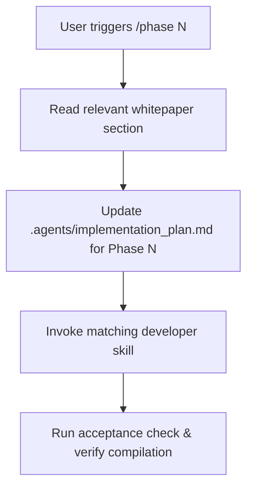

# Workflows: Build Phase Template

This workflow template dictates how the AI agent processes phase-specific implementation requests.

---

## Command Trigger: `/phase N`

When the USER triggers a phase development step by stating `/phase N` (where `N` is the phase number from 1 to 6), follow this sequential execution pipeline:

### Steps:

1. **Read Whitepaper Section**:
   - Locate the requirements and specifications for Phase `N` in the provided whitepaper/codelab references (e.g., [Codelab](https://codelabs.developers.google.com/secure-agentic-coding)).
   - Extract agent architecture, safety limits, tools, and expectations for the phase.

2. **Update Implementation Plan**:
   - Open `.agents/implementation_plan.md`.
   - Update the specific heading for **Phase N** with findings, goals, proposed classes, changes, and verification plans.

3. **Invoke Matching Skill**:
   - Optional first step: `@ponytail` to keep scope minimal for the phase.
   - Find and read the instruction skill inside `.agents/skills/` relevant to the phase task (e.g., `scaffold-adk-java`, `integrate-mcp`, `add-agent`, `ponytail`, etc.).
   - Follow the skill instructions to implement the Java ADK classes, tools, or configuration.

4. **Run Acceptance Check**:
   - Compile code using `mvn clean compile`.
   - Run tests or demo scenarios using `run-eval` or `demo-scenario` skills.
   - Verify outputs adhere to the safety standards defined in `.agents/CONTEXT.md`.
